# agent-skills-search

Pipeline that turns the repo list in [`repo-seeds/registry.json`](repo-seeds/registry.json)
into a locally searchable, embedded index of `SKILL.md` files.

`registry.json` is the single source of truth for which repos feed the
pipeline — **one row per repo**, with a `sources` list recording *every*
channel that ever surfaced it (repos are routinely found more than once,
and that overlap is tracked, not collapsed):

- **seed** — from the vendored [awesome-agent-skills](repo-seeds/awesome-agent-skills/README.md) list
- **search** — found via [`search_github.py`](search_github.py) (GitHub Search API), approved by a human after review; keeps the query/sort/`--exact` used
- **manual** — added by hand, with a required note explaining why
- **marketplace** — found via [`fetch_marketplace.py`](fetch_marketplace.py) in Anthropic's official [Claude plugin marketplace](https://github.com/anthropics/claude-plugins-official) listing, added additively without review

However many sources list a repo, it's still cloned once and its skills
indexed once — see [Pipeline](#pipeline) below for why that overlap is
useful signal rather than noise to deduplicate away.

Curate the registry with [`registry.py`](registry.py) (`add-manual`, `add-search`, `sync-seed`, `skip`/`unskip`, `list`, `remove`) — never hand-edit `registry.json`. See [Pipeline](#pipeline) below for the full repo-discovery → review → registry → clone flow, and [`DAILY_JOB.md`](DAILY_JOB.md) for the recurring maintenance workflow (reviewing/skipping repos, blacklisting individual skills, pulling in new repos, and rerunning the index).

## Recreating this setup from scratch (quickstart)

Everything in this project is either **checked into git** or **generated
from what's checked into git** — nothing is one-of-a-kind or hand-crafted
outside the repo, so there is no data-loss risk. Two ways to get a fully
working copy on a new machine:

| | What you get | Time | Command |
|---|---|---|---|
| **A. Git + data bundle** (recommended) | Everything, instantly | ~1 min download | [Step 0 below](#0-prereqs-get-the-data) |
| **B. Git only, rebuild from scratch** | Everything, freshly generated | ~30–60 min (clones ~180 repos + embeds) | [Step 4 below](#4-full-end-to-end-clone--extract--index--query) |

Both start from `git clone` of this repo — the only input that must be
version-controlled, `repo-seeds/` (the list of repos to pull skills from),
always comes along for free. Path A additionally restores the generated
`repos/`, `search-raw/`, and `qdrant_db/` from a zip on the latest GitHub
Release instead of regenerating them. See [Directories](#directories) for
exactly which files are git-tracked vs. generated vs. downloaded, and
[Pipeline](#pipeline) for how the generation scripts feed into each other.

## DEMO

### 0. Prereqs: get the data

`repos/`, `search-raw/`, and `qdrant_db/` are gitignored (too large/generated
to commit) — everything under those three directories is *derived* from
`repo-seeds/` (see [Directories](#directories)) by running the pipeline.
`repo-seeds/` itself **is** checked into git, so this whole setup can always
be recreated two ways:

- **from git alone**: `repo-seeds/` is already there — run the
  [full end-to-end](#4-full-end-to-end-clone--extract--index--query) pipeline
  to regenerate everything else, or
- **from git + the data bundle**: skip straight to a working setup by
  downloading the pre-built `repos/` + `search-raw/` + `qdrant_db/` (and,
  redundantly, `repo-seeds/`) below instead of re-cloning ~180 repos and
  re-indexing from scratch.

Download the pre-built data bundle from the latest
[GitHub Release](https://github.com/cdennison/ah-skills/releases) and extract
it into this directory (`search-demo/`). Releases can carry multiple old
copies of the asset — always fetch the **latest** release, never a specific
older one; the commands below do this automatically (no version/tag pinned).

Requires the [GitHub CLI](https://cli.github.com/) (`gh`), authenticated via
`gh auth login`.

**Mac / Linux:**

```bash
cd search-demo
gh release download --repo cdennison/ah-skills --pattern search_demo_data.zip --clobber
unzip -o search_demo_data.zip
```

**Windows (PowerShell):**

```powershell
cd search-demo
gh release download --repo cdennison/ah-skills --pattern search_demo_data.zip --clobber
Expand-Archive -Path search_demo_data.zip -DestinationPath . -Force
```

This restores `repos/`, `search-raw/`, and `qdrant_db/` so you can skip
straight to querying (step 2 below), or re-run any pipeline stage on top of
it. If you'd rather build everything from scratch instead, skip this step
and use the [full end-to-end](#4-full-end-to-end-clone--extract--index--query)
flow.

### 1. Install everything

```bash
python3 -m venv .venv
.venv/bin/python -m pip install "qdrant-client[fastembed]"
cp .env.example .env   # then add your GITHUB_PAT
```

### 2. Query only (assumes `qdrant_db/` already exists)

```bash
.venv/bin/python query.py "excel spreadsheets"
```

### 3. Index only (assumes `repos/` already exists)

```bash
python3 extract_search_raw.py
.venv/bin/python index_qdrant.py
```

### 4. Full end-to-end (clone → extract → index → query)

```bash
python3 clone_repos.py
python3 extract_search_raw.py
.venv/bin/python index_qdrant.py
.venv/bin/python query.py "excel spreadsheets"
```

## Architecture

Rendered: [`docs/architecture.jpg`](docs/architecture.jpg) · Source: [`docs/architecture.mmd`](docs/architecture.mmd) · Keeping them in sync: [`docs/ARCHITECTURE.md`](docs/ARCHITECTURE.md)

```mermaid
flowchart LR
    subgraph inputs ["Repo discovery"]
        awesome["awesome-agent-skills/README.md\n(upstream awesome-list)"]
        search["search_github.py\nGitHub Search API"]
        manualEntry["hand-picked repo\n+ reason"]
        marketplace["fetch_marketplace.py\nanthropic claude-plugins-official\nmarketplace.json"]
    end

    subgraph review ["Human review"]
        queue["github_search_results.json\nreview queue, never read by pipeline"]
        human([you: approve/reject])
    end

    registryPy["registry.py\n(add-manual / add-search CLI)"]
    registry[("repo-seeds/registry.json\nsingle source of truth, ONE row per repo\nsources: [] -- overlap across channels\nis tracked, not deduped away")]

    subgraph env [.env]
        pat[GITHUB_PAT]
    end

    runner["run_pipeline.sh\n(cron/launchd, safe to run several times/day --\nclone's own 24h per-repo skip + incremental index)"]
    clone[clone_repos.py]
    repos[(repos/)]
    extract[extract_search_raw.py]
    raw[(search-raw/)]
    index["index_qdrant.py\n(incremental: hash-diff, only embeds new/changed)"]
    db[(qdrant_db/)]

    subgraph consumers [Query]
        query[query.py — CLI]
        app[app/streamlit_app.py — web UI]
    end

    user([you])

    awesome -- "build_registry.py (one-time migration)\nregistry.py sync-seed\n(adds a 'seed' descriptor -- even to a\nrepo already tracked via another channel)" --> registry
    search -- "ranked candidates" --> queue
    queue --> human
    human -- "registry.py add-search --approve owner/repo" --> registryPy
    manualEntry -- "registry.py add-manual owner/repo reason" --> registryPy
    marketplace -- "no review needed\nadds a 'marketplace' descriptor" --> registry
    registryPy -- "adds a 'search'/'manual' descriptor" --> registry

    runner -- "invokes in order" --> marketplace
    runner -- "invokes in order" --> clone
    runner -- "invokes in order" --> extract
    runner -- "invokes in order" --> index
    registry -- "owner/repo pairs, deduped 1:1\n(clone once regardless of source count)" --> clone
    pat -.auth.-> clone
    clone -- "git clone --depth 1, skip if cloned <24h ago" --> repos
    repos -- "find SKILL.md\n(one point per file, regardless of\nhow many registry sources found the repo)" --> extract
    extract --> raw
    raw -- "diff by content hash, embed only changed (dense + BM25)" --> index
    index --> db
    db --> query
    db --> app
    user -- "search text" --> query
    user -- "search text" --> app
    query -- "ranked SKILL.md hits" --> user
    app -- "ranked SKILL.md hits" --> user
```



Repo discovery is now decoupled from cloning: `registry.json` is the single
source of truth `clone_repos.py` reads — **one row per repo**, never one row
per discovery event. Every row carries a `sources` **list**, because the
same repo routinely gets discovered more than once — it might be in the
vendored awesome-list *and* turn up in a `search_github.py` query *and* be
listed in the Claude plugin marketplace. That overlap is deliberately kept
visible rather than collapsed to whichever channel got there first: a repo
three independent sources agree on is a useful signal, and `registry.py
list` / `./registry.py list --source X` can always tell you every channel
that ever surfaced a given repo. Each source descriptor's `type` is one of:

- `seed` — the vendored awesome-list, migrated in once by
  `build_registry.py`, additively resynced by `registry.py sync-seed`
- `search` — found by `search_github.py`, approved by a human, keeps the
  query/sort/`--exact` used
- `manual` — added by hand with a required reason
- `marketplace` — found by `fetch_marketplace.py` in Anthropic's official
  Claude plugin marketplace listing, added without review since it's a
  curated Anthropic source

Nothing gets into the registry without going through `registry.py`, so
provenance is always recorded — see [Curating the repo
registry](#curating-the-repo-registry) below and
[`DAILY_JOB.md`](DAILY_JOB.md) for the recurring maintenance workflow.

**Overlap at the registry layer never means duplicate work downstream.**
However many sources list a repo, `clone_repos.py` still clones it exactly
once (the registry has one row per repo, full stop), and
`extract_search_raw.py`/`index_qdrant.py` still produce exactly one Qdrant
point per `SKILL.md` path found on disk. `sources` answers "where did we
hear about this repo from," never "how many times is it indexed" — that's
always once.

Each arrow into `repos/`, `search-raw/`, or `qdrant_db/` past the registry is
a script reading the previous stage's output directory and writing the next
one — the pipeline itself is still independent scripts chained by the
filesystem, no shared process or server. `query.py` and the
[Streamlit app](app/README.md) are two independent, interchangeable ways to
search the same `qdrant_db/` once it exists — neither writes back to it.

### Curating the repo registry

Never hand-edit `repo-seeds/registry.json` — use `registry.py`:

```bash
# Add one repo by hand, with a required reason
./registry.py add-manual owner/repo "found it linked from a blog post about agent tooling"

# Search GitHub, review the candidates, then approve the ones you want
./search_github.py "agents skills" --exact --format json --top 25 \
    --out repo-seeds/github_search_results.json
# (review repo-seeds/github_search_results.json yourself)
./registry.py add-search repo-seeds/github_search_results.json \
    --approve owner/repo --approve owner2/repo2

# Pick up repos from Anthropic's official Claude plugin marketplace -- no review needed.
# A repo already tracked via another channel gets a "marketplace" descriptor ADDED
# to its existing entry (surfacing the overlap), not a separate/duplicate row.
./fetch_marketplace.py

# Same idea for the vendored awesome-list: adds a "seed" descriptor to any repo it
# finds, including ones already tracked via search/manual/marketplace.
./registry.py sync-seed

# Mark a repo skip (does NOT affect the pipeline yet -- see DAILY_JOB.md)
./registry.py skip owner/repo "reason from user feedback, etc."
./registry.py unskip owner/repo

# List / audit what's in the registry
./registry.py list                    # everything, with every source each repo was found through
./registry.py list --source search    # anything with at least one search-discovered descriptor
./registry.py list --status skip      # just the skipped ones

# Remove a repo (mistakes only -- e.g. a typo'd owner/repo; use `skip` for quality judgments)
./registry.py remove owner/repo
```

`./registry.py list` shows every repo's full source history, e.g. a repo
found in both the awesome-list and the marketplace prints as
`[seed+marketplace]` with both descriptors' detail. That overlap is
informational only — it doesn't change how many times the repo gets cloned
or how many times its skills get indexed (always once each); see
[Pipeline](#pipeline) above.

Excluding an individual *skill* (rather than a whole repo) is a separate,
already-enforced mechanism — see `blacklist.py` / [`DAILY_JOB.md`](DAILY_JOB.md).

`clone_repos.py` picks up whatever's in `registry.json` on its next run —
nothing else needs to change. `search_github.py`'s JSON output is a review
queue only; `github_search_results.json` is never read by the pipeline
itself, only by `registry.py add-search` once you've decided which
candidates to approve.

## Setup

`index_qdrant.py` and `query.py` need `qdrant-client[fastembed]`, installed in a local venv:

```bash
python3 -m venv .venv
.venv/bin/python -m pip install "qdrant-client[fastembed]"
```

Use `.venv/bin/python` in place of `python3` for those two scripts (shown below). `clone_repos.py` and `extract_search_raw.py` have no extra dependencies and can run with the system `python3`.

## Pipeline

The three scripts run in order, each consuming the previous step's output:

```
clone_repos.py  -->  extract_search_raw.py  -->  index_qdrant.py
   repos/              search-raw/               qdrant_db/
```

1. **`clone_repos.py`** — reads every `(owner, repo)` pair from
   `repo-seeds/registry.json` (see [Curating the repo
   registry](#curating-the-repo-registry)) and shallow-clones (`--depth 1`)
   each one into `repos/<owner>/<repo>`. Clones are paced against GitHub's
   live `/rate_limit` quota (60/hr unauthenticated, 5,000/hr with a PAT) and
   repos cloned in the last 24h — tracked in `.clone_state.json` — are
   skipped.

   ```bash
   python3 clone_repos.py                # clone every repo in registry.json
   python3 clone_repos.py 10             # clone only the first 10
   python3 clone_repos.py <github-url>   # clone a single repo one-off (bypasses the registry)
   ```

   If a `GITHUB_PAT` is set (see [Authentication](#authentication)), clones
   are authenticated, raising the GitHub rate limit from 60 to 5,000
   requests/hour.

2. **`extract_search_raw.py`** — walks `repos/`, finds every `SKILL.md` (per
   the [agentskills.io](https://agentskills.io) spec), and copies them into
   `search-raw/`, preserving the `owner/repo/...` path structure. A handful
   of repos document their skills collection in a top-level `README.md`
   instead of per-skill `SKILL.md` files (see `EXTRA_README_REPOS` in the
   script); those are copied too. Prints a stats summary (file/skill counts,
   lines, characters, size) when it finishes.

   ```bash
   python3 extract_search_raw.py
   ```

3. **`index_qdrant.py`** — reads every file in `search-raw/`, parses its
   YAML frontmatter (`name`, `description`), and embeds
   `name: description\n\ncontent` twice per file: once as a **dense** vector
   (`all-MiniLM-L6-v2`) and once as a **sparse** BM25 vector (`Qdrant/bm25`),
   both via Qdrant's built-in FastEmbed integration. Vectors + payload are
   stored in a local, on-disk Qdrant collection (`agent_skills`) at
   `qdrant_db/`. Re-running the script drops and rebuilds the collection
   from scratch.

   ```bash
   .venv/bin/python index_qdrant.py
   ```

Run all three in sequence to rebuild everything from a clean checkout:

```bash
python3 clone_repos.py && python3 extract_search_raw.py && .venv/bin/python index_qdrant.py
```

## Querying

Once `qdrant_db/` is built, search it with `query.py`:

```bash
.venv/bin/python query.py "excel spreadsheets"
.venv/bin/python query.py "excel spreadsheets" -n 10   # change result count (default 5)
```

Prints each hit's similarity score, file path, and description. See
[`USE_CASES.md`](USE_CASES.md) for example queries and why they work well
against this corpus.

### Re-indexing

Whenever `search-raw/` changes (new repos, new skills), just rebuild the index —
it always drops and recreates the collection from scratch, so it's safe to
re-run any time:

```bash
.venv/bin/python index_qdrant.py
```

### How embeddings work (no API key required)

Embeddings are generated **locally** via [FastEmbed](https://github.com/qdrant/fastembed),
which `qdrant-client[fastembed]` bundles directly — there's no external
embedding API involved. The model (`sentence-transformers/all-MiniLM-L6-v2`)
is a small ONNX model that:

- downloads once from Hugging Face on first use and is cached under
  `~/.cache` (a `HF_TOKEN` is optional and only raises rate limits — not
  required for this public model),
- runs inference on-device via ONNX Runtime, so embedding calls make no
  network requests and cost nothing per query.

`models.Document(text=..., model=...)` tells the Qdrant client to embed that
text with the local model automatically, both on upload
(`upload_collection`) and on query (`query_points`). The vector store itself
is also fully local and embedded in-process (`QdrantClient(path="qdrant_db")`) —
no Qdrant server to run or connect to.

### Hybrid dense + sparse (BM25) search

Dense embeddings (MiniLM) are good at *semantic* matches ("spreadsheet" ↔
"excel") but weak at exact keyword/identifier matches, which matter a lot
here since queries often name a specific tool, library, or CLI flag
(`kicad`, `n8n`, `SPLADE`, `bm25`) that a dense model may not embed near the
literal term. Every skill is indexed with both:

- a **dense** vector (`all-MiniLM-L6-v2`), for semantic similarity, and
- a **BM25 sparse** vector (FastEmbed's `Qdrant/bm25`), for exact lexical
  term matching (like Elasticsearch/Lucene) — pure term-frequency scoring,
  no extra neural model or GPU needed.

`query.py` searches both (`prefetch`) and combines the results with Qdrant's
`FusionQuery(fusion=models.Fusion.RRF)`, so a query ranks well whether it's
phrased as a task description or names an exact tool.

A learned-sparse model like **SPLADE** would give better recall than BM25 by
expanding queries to related terms, but it requires a second, heavier ONNX
model for a benefit that mostly matters at much larger scale or noisier text
than short, well-structured `SKILL.md` files — not worth it here.

## Authentication

`clone_repos.py` reads a GitHub Personal Access Token from a `GITHUB_PAT`
entry in `.env` (or the `GITHUB_PAT` environment variable) and uses it to
authenticate clones over HTTPS, avoiding the unauthenticated rate limit.

Copy the template and fill in your token:

```bash
cp .env.example .env
```

```
# .env
GITHUB_PAT=ghp_xxxxxxxxxxxxxxxxxxxx
```

`.env.example` documents the expected format and ships in the repo (safe to
commit — no real secret in it); `.env` itself is gitignored.

The token is passed to `git` via an HTTP auth header (`-c
http.extraheader`) rather than embedded in the clone URL, so it never ends
up in a cloned repo's `.git/config` or in process listings. If no token is
found, cloning proceeds unauthenticated with a warning.

**`.env` contains a secret — do not commit it.**

## Directories

- `repo-seeds/` — **git-tracked** input that drives everything else; nothing
  under it is ever generated, so it's the one directory that's always present
  from a plain `git clone`, with no separate download needed
  - `registry.json` — **the single source of truth `clone_repos.py` reads,
    one row per repo.** Each row has a `sources` array — every channel
    (`seed | search | manual | marketplace`) that ever surfaced this repo,
    each with its own provenance detail (seed file, search query/sort/exact,
    manual note, or marketplace plugin name). A repo found by more than one
    channel gets more than one descriptor — that overlap is tracked, not
    collapsed to a single "source." Also carries a `status: active | skip`
    (skip is currently schema-only/inert, see [`DAILY_JOB.md`](DAILY_JOB.md)),
    a `last_synced` timestamp (cloned + through RAG, stamped by `registry.py
    mark-synced`, the last step of `run_pipeline.sh`), and — only on failure
    — `last_sync_failure`/`last_sync_failure_reason`. Run `./registry.py
    unsynced` to see what hasn't synced today. Curate only via
    `registry.py` — see [Curating the repo
    registry](#curating-the-repo-registry)
  - `skill_blacklist.json` — individual `SKILL.md` paths to exclude, each
    with a required reason. Curate only via `blacklist.py`; **enforced** by
    `extract_search_raw.py` (unlike registry skip, this one actually does
    something) — see [`DAILY_JOB.md`](DAILY_JOB.md)
  - `awesome-agent-skills/` — vendored copy of the upstream repo-list README;
    feeds `registry.json` (`source: seed`) via the one-time
    `build_registry.py` migration and the additive `registry.py sync-seed`,
    not read directly by the pipeline anymore
  - `MANUAL_REPOS.md` — **historical only**, superseded by `registry.json`;
    no longer read by any script
  - `github_search_results.json` — output of `search_github.py`, a **review
    queue** for a human to approve/reject; never read by the pipeline, only
    by `registry.py add-search` once approved
  - `claude_plugins_marketplace.json` — cached copy of Anthropic's
    `claude-plugins-official` marketplace listing, refreshed each time
    `fetch_marketplace.py` runs; feeds `registry.json` (`source:
    marketplace`) additively, no human review step
- `repos/` — cloned repos (**generated** by `clone_repos.py` from `repo-seeds/registry.json`; gitignored)
- `search-raw/` — extracted `SKILL.md` files (**generated** by `extract_search_raw.py`; gitignored)
- `qdrant_db/` — local Qdrant vector store (**generated** by `index_qdrant.py`; gitignored)
- `.venv/` — Python virtualenv with `qdrant-client[fastembed]` installed
- `.env` / `.env.example` — `GITHUB_PAT` config (actual / template)
- `.clone_state.json` — last-cloned timestamps, used to skip recent re-clones
- `query.py` — CLI for hybrid (dense + BM25 sparse) search over `qdrant_db/`
- `USE_CASES.md` — example search queries and why they work
- `docs/` — architecture diagram source (`.mmd`) and rendered image (`.jpg`);
  see [`docs/ARCHITECTURE.md`](docs/ARCHITECTURE.md) for how to keep the two in sync,
  and [`docs/QUERY_INTERFACE.md`](docs/QUERY_INTERFACE.md) for the Qdrant
  collection schema, payload fields, and hybrid-search query shape (start
  here when wiring up a new frontend)
- `make_data_zip.sh` — bundles `repo-seeds/`, `repos/`, `search-raw/`, and
  `qdrant_db/` into `search_demo_data.zip` for upload to a GitHub Release
  (see below); `repo-seeds/` is included redundantly so the zip alone is a
  complete, self-contained snapshot even without git

## Publishing the data bundle (maintainers)

After rebuilding the pipeline locally, regenerate and upload the data bundle
so others can skip re-cloning/re-indexing:

```bash
cd search-demo
./make_data_zip.sh                 # writes search_demo_data.zip
gh release upload <tag> search_demo_data.zip --clobber
```

If no release exists yet, create one first: `gh release create <tag>`.
