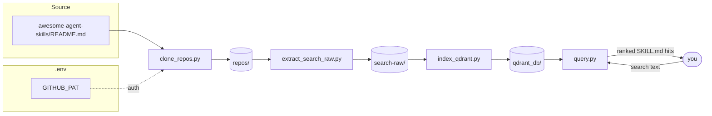

# agent-skills-search

Pipeline that turns the repo list in [awesome-agent-skills](awesome-agent-skills/README.md)
into a locally searchable, embedded index of `SKILL.md` files.

## DEMO

### 1. Install everything

```bash
python3 -m venv .venv
.venv/bin/python -m pip install "qdrant-client[fastembed]"
cp .env.example .env   # then add your GITHUB_PAT
```

### 2. Query only (assumes `qdrant_db/` already exists)

```bash
.venv/bin/python query.py "excel spreadsheets"
```

### 3. Index only (assumes `repos/` already exists)

```bash
python3 extract_search_raw.py
.venv/bin/python index_qdrant.py
```

### 4. Full end-to-end (clone → extract → index → query)

```bash
python3 clone_repos.py
python3 extract_search_raw.py
.venv/bin/python index_qdrant.py
.venv/bin/python query.py "excel spreadsheets"
```

## Architecture

Rendered: [`docs/architecture.jpg`](docs/architecture.jpg) · Source: [`docs/architecture.mmd`](docs/architecture.mmd)



Each arrow is a script reading the previous stage's output directory and
writing the next one — the pipeline is just four independent scripts chained
by the filesystem, no shared process or server.

## Setup

`index_qdrant.py` and `query.py` need `qdrant-client[fastembed]`, installed in a local venv:

```bash
python3 -m venv .venv
.venv/bin/python -m pip install "qdrant-client[fastembed]"
```

Use `.venv/bin/python` in place of `python3` for those two scripts (shown below). `clone_repos.py` and `extract_search_raw.py` have no extra dependencies and can run with the system `python3`.

## Pipeline

The three scripts run in order, each consuming the previous step's output:

```
clone_repos.py  -->  extract_search_raw.py  -->  index_qdrant.py
   repos/              search-raw/               qdrant_db/
```

1. **`clone_repos.py`** — reads `awesome-agent-skills/README.md`, extracts every
   unique `github.com/owner/repo` link, and shallow-clones (`--depth 1`) each
   one into `repos/<owner>/<repo>`. Clones are paced against GitHub's live
   `/rate_limit` quota (60/hr unauthenticated, 5,000/hr with a PAT) and repos
   cloned in the last 24h — tracked in `.clone_state.json` — are skipped.

   ```bash
   python3 clone_repos.py                # clone every repo in the README
   python3 clone_repos.py 10             # clone only the first 10
   python3 clone_repos.py <github-url>   # clone a single repo one-off
   ```

   If a `GITHUB_PAT` is set (see [Authentication](#authentication)), clones
   are authenticated, raising the GitHub rate limit from 60 to 5,000
   requests/hour.

2. **`extract_search_raw.py`** — walks `repos/`, finds every `SKILL.md` (per
   the [agentskills.io](https://agentskills.io) spec), and copies them into
   `search-raw/`, preserving the `owner/repo/...` path structure. A handful
   of repos document their skills collection in a top-level `README.md`
   instead of per-skill `SKILL.md` files (see `EXTRA_README_REPOS` in the
   script); those are copied too. Prints a stats summary (file/skill counts,
   lines, characters, size) when it finishes.

   ```bash
   python3 extract_search_raw.py
   ```

3. **`index_qdrant.py`** — reads every file in `search-raw/`, parses its
   YAML frontmatter (`name`, `description`), and embeds
   `name: description\n\ncontent` twice per file: once as a **dense** vector
   (`all-MiniLM-L6-v2`) and once as a **sparse** BM25 vector (`Qdrant/bm25`),
   both via Qdrant's built-in FastEmbed integration. Vectors + payload are
   stored in a local, on-disk Qdrant collection (`agent_skills`) at
   `qdrant_db/`. Re-running the script drops and rebuilds the collection
   from scratch.

   ```bash
   .venv/bin/python index_qdrant.py
   ```

Run all three in sequence to rebuild everything from a clean checkout:

```bash
python3 clone_repos.py && python3 extract_search_raw.py && .venv/bin/python index_qdrant.py
```

## Querying

Once `qdrant_db/` is built, search it with `query.py`:

```bash
.venv/bin/python query.py "excel spreadsheets"
.venv/bin/python query.py "excel spreadsheets" -n 10   # change result count (default 5)
```

Prints each hit's similarity score, file path, and description. See
[`USE_CASES.md`](USE_CASES.md) for example queries and why they work well
against this corpus.

### Re-indexing

Whenever `search-raw/` changes (new repos, new skills), just rebuild the index —
it always drops and recreates the collection from scratch, so it's safe to
re-run any time:

```bash
.venv/bin/python index_qdrant.py
```

### How embeddings work (no API key required)

Embeddings are generated **locally** via [FastEmbed](https://github.com/qdrant/fastembed),
which `qdrant-client[fastembed]` bundles directly — there's no external
embedding API involved. The model (`sentence-transformers/all-MiniLM-L6-v2`)
is a small ONNX model that:

- downloads once from Hugging Face on first use and is cached under
  `~/.cache` (a `HF_TOKEN` is optional and only raises rate limits — not
  required for this public model),
- runs inference on-device via ONNX Runtime, so embedding calls make no
  network requests and cost nothing per query.

`models.Document(text=..., model=...)` tells the Qdrant client to embed that
text with the local model automatically, both on upload
(`upload_collection`) and on query (`query_points`). The vector store itself
is also fully local and embedded in-process (`QdrantClient(path="qdrant_db")`) —
no Qdrant server to run or connect to.

### Hybrid dense + sparse (BM25) search

Dense embeddings (MiniLM) are good at *semantic* matches ("spreadsheet" ↔
"excel") but weak at exact keyword/identifier matches, which matter a lot
here since queries often name a specific tool, library, or CLI flag
(`kicad`, `n8n`, `SPLADE`, `bm25`) that a dense model may not embed near the
literal term. Every skill is indexed with both:

- a **dense** vector (`all-MiniLM-L6-v2`), for semantic similarity, and
- a **BM25 sparse** vector (FastEmbed's `Qdrant/bm25`), for exact lexical
  term matching (like Elasticsearch/Lucene) — pure term-frequency scoring,
  no extra neural model or GPU needed.

`query.py` searches both (`prefetch`) and combines the results with Qdrant's
`FusionQuery(fusion=models.Fusion.RRF)`, so a query ranks well whether it's
phrased as a task description or names an exact tool.

A learned-sparse model like **SPLADE** would give better recall than BM25 by
expanding queries to related terms, but it requires a second, heavier ONNX
model for a benefit that mostly matters at much larger scale or noisier text
than short, well-structured `SKILL.md` files — not worth it here.

## Authentication

`clone_repos.py` reads a GitHub Personal Access Token from a `GITHUB_PAT`
entry in `.env` (or the `GITHUB_PAT` environment variable) and uses it to
authenticate clones over HTTPS, avoiding the unauthenticated rate limit.

Copy the template and fill in your token:

```bash
cp .env.example .env
```

```
# .env
GITHUB_PAT=ghp_xxxxxxxxxxxxxxxxxxxx
```

`.env.example` documents the expected format and ships in the repo (safe to
commit — no real secret in it); `.env` itself is gitignored.

The token is passed to `git` via an HTTP auth header (`-c
http.extraheader`) rather than embedded in the clone URL, so it never ends
up in a cloned repo's `.git/config` or in process listings. If no token is
found, cloning proceeds unauthenticated with a warning.

**`.env` contains a secret — do not commit it.**

## Directories

- `awesome-agent-skills/` — source list of repos (external, not generated)
- `repos/` — cloned repos (generated by `clone_repos.py`)
- `search-raw/` — extracted `SKILL.md` files (generated by `extract_search_raw.py`)
- `qdrant_db/` — local Qdrant vector store (generated by `index_qdrant.py`)
- `.venv/` — Python virtualenv with `qdrant-client[fastembed]` installed
- `.env` / `.env.example` — `GITHUB_PAT` config (actual / template)
- `.clone_state.json` — last-cloned timestamps, used to skip recent re-clones
- `query.py` — CLI for hybrid (dense + BM25 sparse) search over `qdrant_db/`
- `USE_CASES.md` — example search queries and why they work
- `docs/` — architecture diagram source (`.mmd`) and rendered image (`.jpg`)
