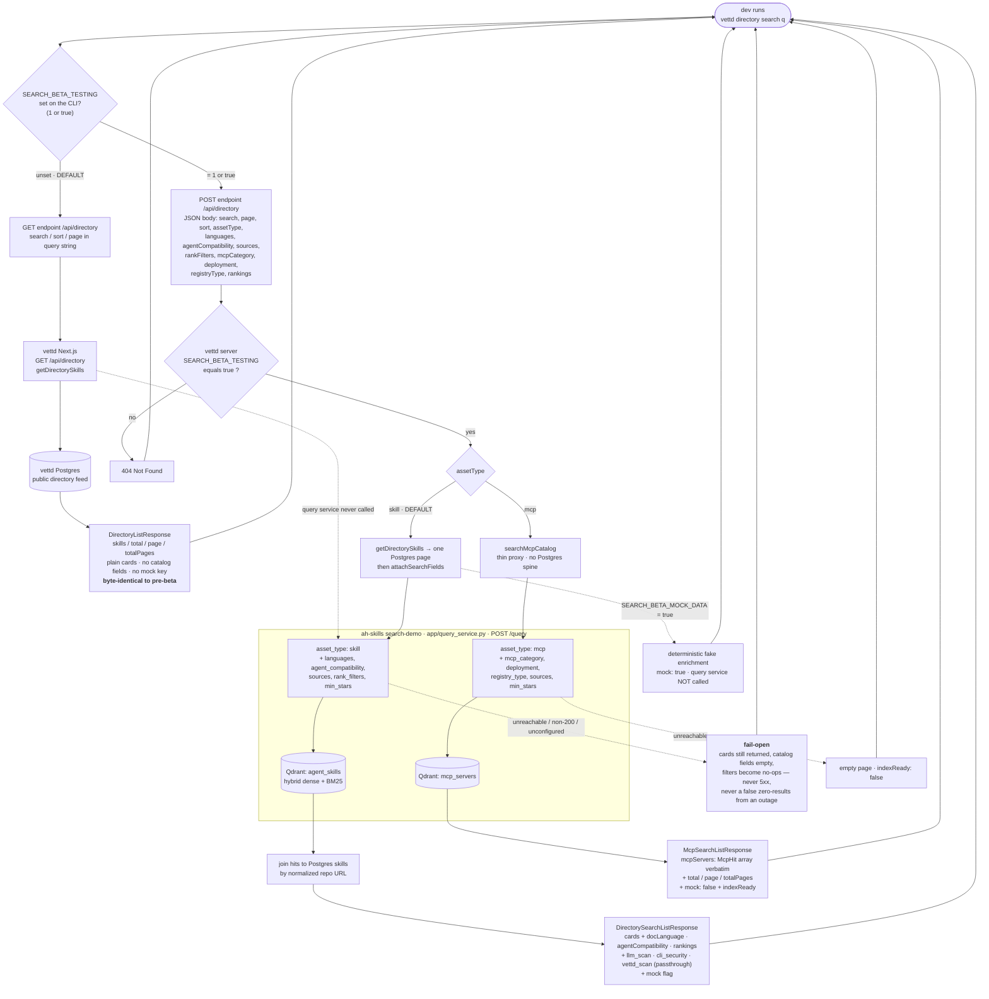

<!-- Hand-maintained. Keep in step with vettd packages/api/src/directory/search-beta.ts
     and vettd-cli src/directory.rs. Contract-sync process:
     vettd-e2e/KEEPING_API_DOCS_IN_SYNC.md -->

# End-to-end search flow: `vettd` CLI → vettd API → query service → Qdrant

How `vettd directory search` reaches this repo's Qdrant collections, and how
the **`SEARCH_BETA_TESTING`** flag changes the whole path — from a
Postgres-only `GET` (flag off, byte-identical to pre-beta) to a `POST` that
joins the `agent_skills` / `mcp_servers` catalog served by
`app/query_service.py` (flag on).

There are **two** `SEARCH_BETA_TESTING` flags and both must be on for the
beta path: the CLI's (`1` or `true`) and the vettd server's (exactly
`"true"`). `inventory search` is the session-authed twin of `directory
search` (the user's own skills); `assetType: "mcp"` is rejected there.

## The two paths, side by side

| | flag **off** (default) | flag **on** (`SEARCH_BETA_TESTING`) |
|---|---|---|
| HTTP | `GET /api/directory?…` | `POST /api/directory` + JSON body |
| vettd handler | `getDirectorySkills()` | `getDirectorySkills()` **+ `attachSearchFields()`** (skill) / `searchMcpCatalog()` (mcp) |
| data sources | vettd Postgres only | Postgres page **+** this repo's `/query` **+** Qdrant `agent_skills` / `mcp_servers` |
| this repo touched? | **no** | **yes** — `query_service.py` → Qdrant |
| response | `DirectoryListResponse` — plain cards, no `mock` key | `DirectorySearchListResponse` (skill) / `McpSearchListResponse` (mcp), catalog-enriched, `mock` flag |
| server flag off | (n/a — GET is unaffected) | `POST` → **404** |
| catalog down | (n/a) | skill: **fail-open** (empty fields, no filtering); mcp: empty page, `indexReady: false` |

## Where each hop lives

| Hop | Code |
|---|---|
| CLI request shape + `SEARCH_BETA_TESTING` gate | `vettd-cli/src/directory.rs`, `src/network.rs` |
| vettd route | `vettd/apps/web/app/api/directory/route.ts`, `…/inventory/route.ts` |
| Postgres page + catalog join + fail-open + mcp proxy | `vettd/packages/api/src/directory/search-beta.ts` |
| `POST /query` (`asset_type`, filters, `SkillHit` / `McpHit`) | `app/query_service.py` (this repo) |
| hybrid search + payload → hit | `app/search.py` / `app/mcp_search.py` |
| Qdrant collections | `agent_skills` (skills pipeline) / `mcp_servers` (`mcp-search/`) |

Full HTTP contract: [`QUERY_SERVICE_API.md`](QUERY_SERVICE_API.md) (this repo,
generated) · `vettd/docs/VETTD_API.md` (vettd side, generated) ·
`vettd/docs/search-beta-api-spec.md` (prose).
